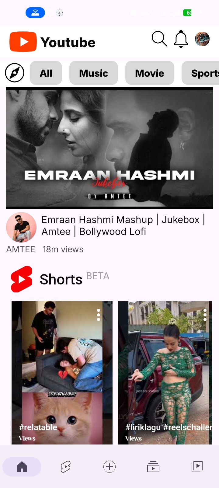
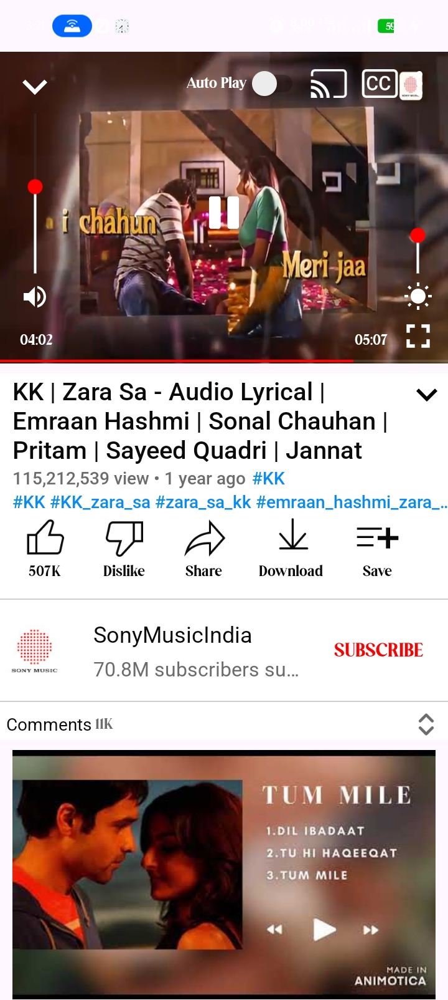
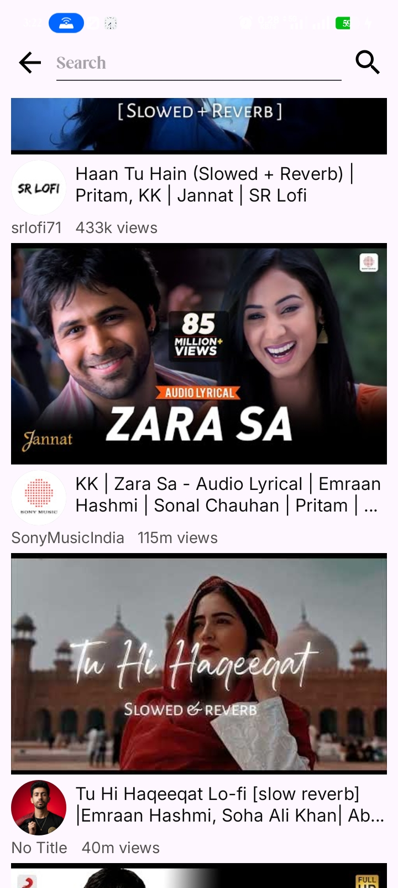
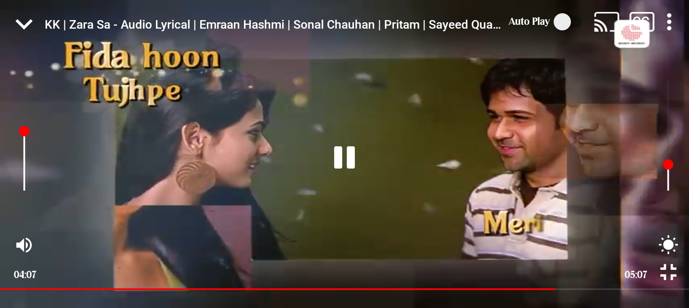
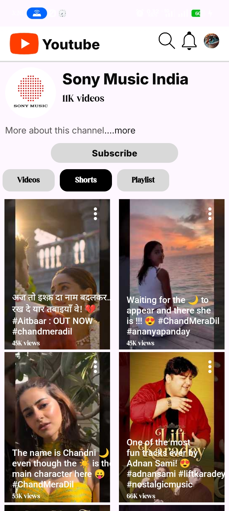
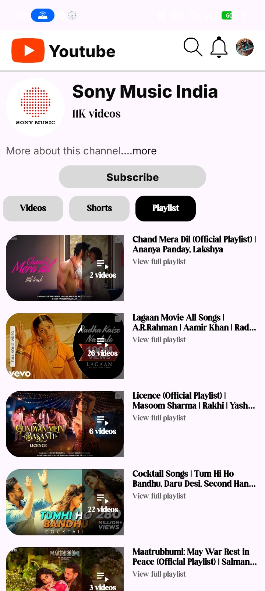
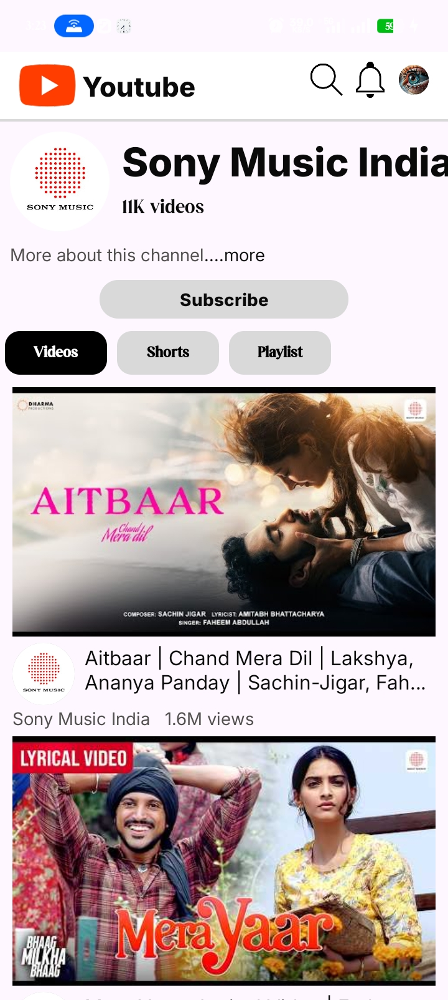

# 🎬 Youtube Clone Android

This project is a **YouTube clone built for Android using XML layouts**. The goal is to create a visually appealing and functional application that mimics the YouTube interface.

---

## 🎨 Figma UI Kit
You can find the Figma UI kit used for this project [here](https://www.figma.com/design/Y4IBRB33ogPXuVO0xY4KtF/Youtube-Clone--Community-?m=auto&t=A9ELVzOoKtuBWSsl-6).

---

## 🧩 Modularization
The project is structured in a **modular architecture**, allowing better separation of concerns and easier maintainability. Each module represents a distinct feature or functionality.

---

## 🧠 ViewModel Architecture
We utilize **ViewModel architecture** from Android's architecture components. This ensures UI data survives configuration changes such as screen rotations.

---

## 📸 Screenshots

### 🏠 Feed Screen

---

### 📱 Portrait Player with Suggestions

---

### 🔍 Search Results Screen

---

### 🎥 Landscape Player with Controls

---

### 📺 Channel — Shorts Tab

---

### 📃 Channel — Playlist Tab

---

### 🎬 Channel — Videos Tab

---

## ℹ️ Additional Information
Feel free to explore the repository, contribute, or report issues.  
Happy coding 🚀

---

> ⚠️ Note: Markdown does not support image resizing.  
> For consistent appearance, resize your images before uploading (recommended width: ~800–1200px).
